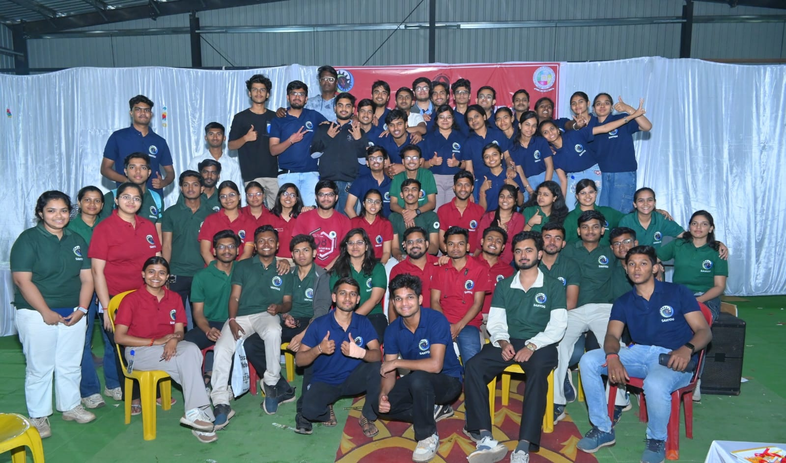
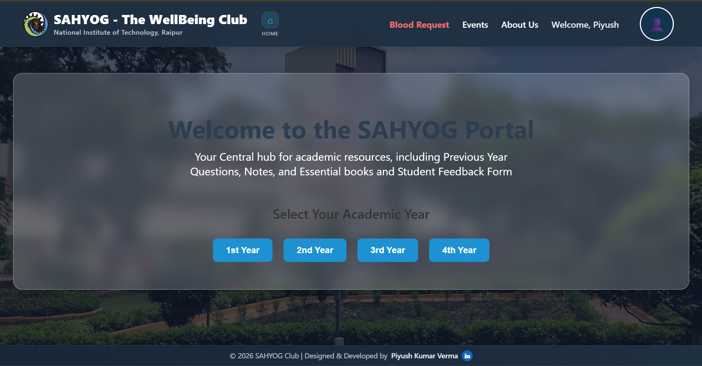
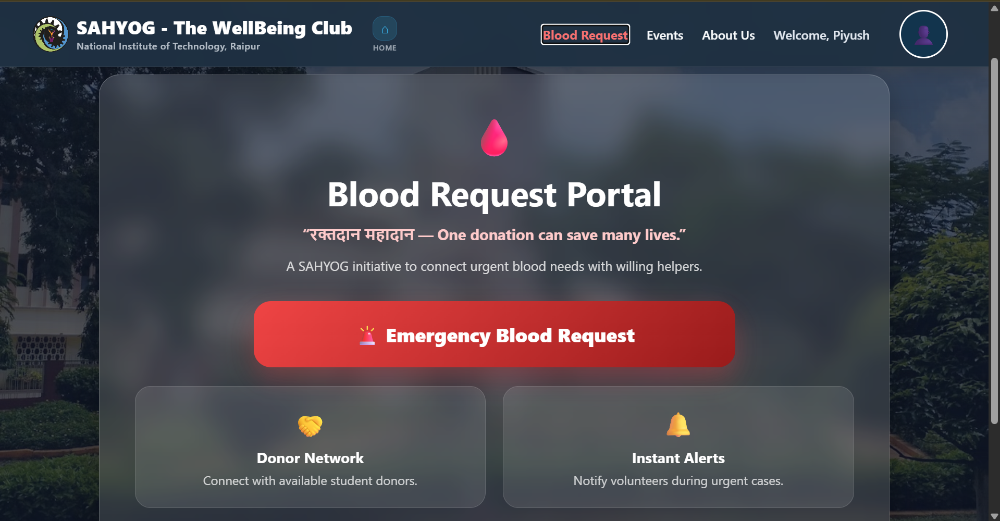
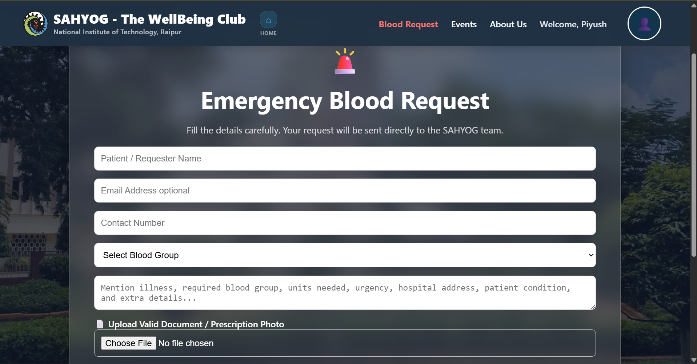
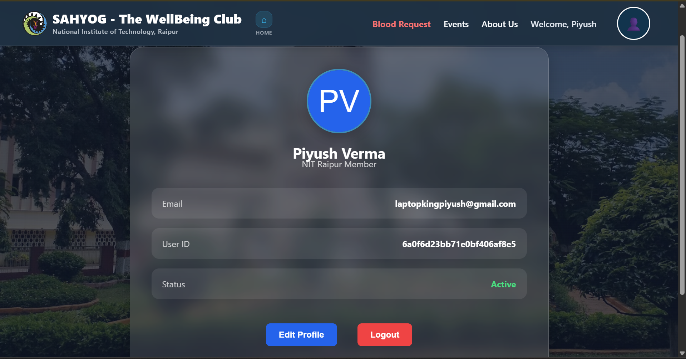
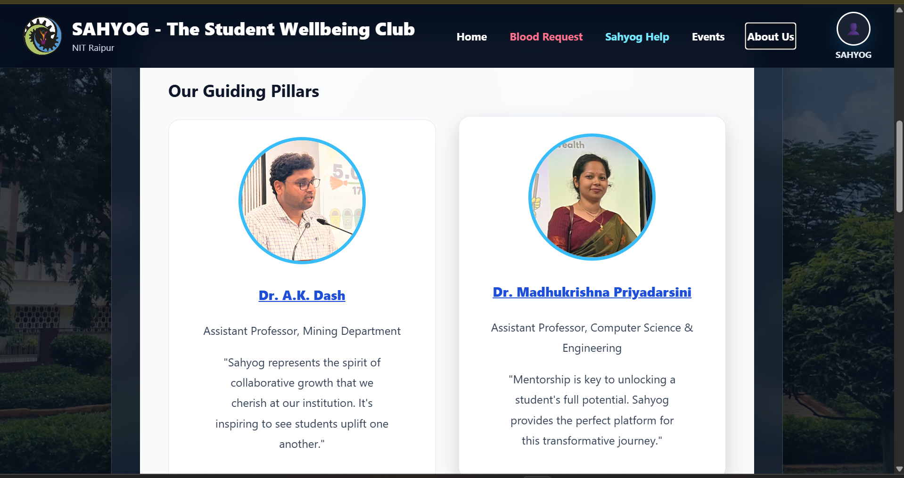

# SAHYOG - The WellBeing Club Portal (NIT Raipur)



A modern full-stack MERN portal developed for **SAHYOG - The WellBeing Club, NIT Raipur**.  
The platform provides academic resources, emergency blood request support, event management, secure authentication, and future student wellbeing services in a centralized ecosystem.

---

# Live Deployment

### Frontend

https://sahyog-nitrr-portal.vercel.app/

### Backend

https://sahyog-backend-topb.onrender.com/

---

# Features

- JWT Authentication System
- Academic Resource & PYQ Portal
- Public & Protected Routes
- Emergency Blood Request System
- Gmail Email Automation
- Prescription / Document Upload
- Events & Announcements Module
- Responsive Modern UI
- Profile Dashboard & Dropdown System
- Future Expansion Ready Architecture

---

# Screenshots

## Home Page



---

## Blood Request Portal



---

## Emergency Blood Request Form



---

## User Profile Dashboard



---

## About Us



---

# Tech Stack

## Frontend

- React.js
- Vite
- React Router DOM
- CSS3
- JavaScript

## Backend

- Node.js
- Express.js
- MongoDB Atlas
- Mongoose
- JWT Authentication
- Nodemailer
- Multer

## Deployment

- Vercel
- Render
- MongoDB Atlas
- GitHub

---

# Project Structure

```bash
frontend/
backend/
```

---

# Blood Request Workflow

```text
User submits request
        ↓
Frontend sends data to backend
        ↓
Backend validates request
        ↓
Prescription/document uploaded
        ↓
Emergency email sent to multiple recipients
```

---

# Security Features

- JWT-based Authentication
- Password Hashing using bcrypt.js
- Protected API Routes
- Environment Variable Protection
- File Upload Validation

---

# Future Enhancements

- AI Student Assistance
- CR Contact System
- Team Information Dashboard
- Real-Time Notifications
- Volunteer Management
- Admin Analytics

---

# Developed By

## Piyush Kumar Verma

Information Technology Department  
National Institute of Technology Raipur

Designed & Developed for  
**SAHYOG - The WellBeing Club**

---

# License

Developed for educational and institutional purposes under SAHYOG Club, NIT Raipur.
