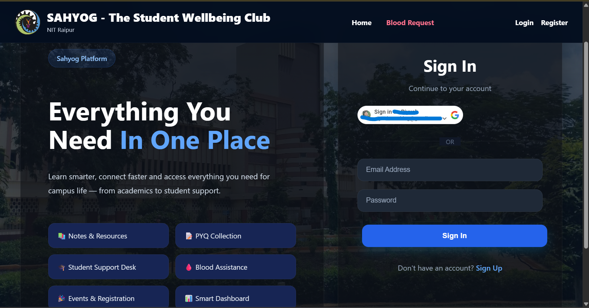
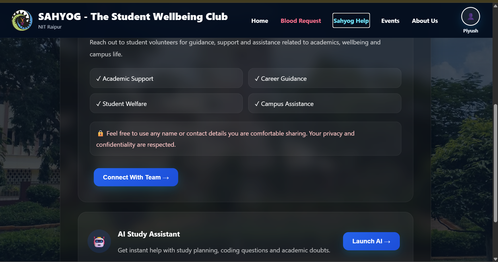
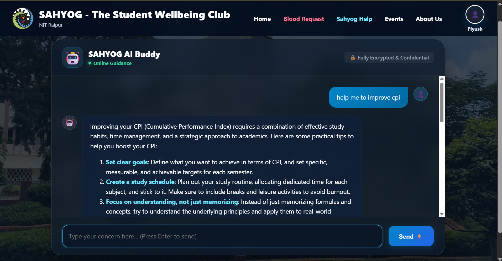

# SAHYOG — The Student Wellbeing Club Portal

### National Institute of Technology, Raipur

<div align="center">


**A full-stack MERN student welfare platform — built for NITRRians, by NITRRians.**

[🌐 Live Portal](https://sahyog-nitrr-portal.vercel.app/) • [⚙️ Backend API](https://sahyog-backend-topb.onrender.com/)

</div>

---

## What is SAHYOG?

SAHYOG is the official digital portal of **SAHYOG — The Student Wellbeing Club, NIT Raipur**. It centralizes academic resources, student support services, community events, blood assistance, and AI-powered guidance into a single, secure platform for the NIT Raipur student community.

---

## Live Deployment

| Service     | Platform      | URL                                       |
| ----------- | ------------- | ----------------------------------------- |
| Frontend    | Vercel        | https://sahyog-nitrr-portal.vercel.app/   |
| Backend API | Render        | https://sahyog-backend-topb.onrender.com/ |
| Database    | MongoDB Atlas | Cloud Hosted                              |

---

## Features

### Authentication & Security

- JWT-based session authentication
- **Google OAuth 2.0 Direct Login** (one-click sign in)
- Password hashing with bcrypt.js
- Protected & public route architecture
- Environment variable protection

### Academic Resources

- Previous Year Question Papers (PYQs) portal
- Filter by Year, Branch & Semester
- Admin-controlled resource upload system
- Google Drive link integration

### Student Support System

- AI-powered chat assistant (SAHYOG AI Buddy) — powered by Groq LLaMA 3.3 70B
- Anonymous support form with direct team notification
- Email dispatch via Brevo API
- Fully confidential request handling

### Blood Assistance

- Emergency blood request portal
- Prescription/document upload support
- Automated email alerts to SAHYOG team
- Multi-recipient notification system

### Community & Events

- Events gallery with image upload (Cloudinary)
- Like/unlike interactions (JWT-protected)
- Admin event management panel

### Profile & Navigation

- User profile dashboard with avatar generation
- Dropdown: My Profile, My Downloads, CR Contact, Team Sahyog, Campus View, Emergency Contacts
- Admin-only export panel (CSV download of support responses)

---

## Tech Stack

### Frontend

| Technology               | Purpose                           |
| ------------------------ | --------------------------------- |
| React.js 18              | UI Framework                      |
| Vite 5                   | Build Tool                        |
| React Router DOM v6      | Client-side Routing               |
| Axios                    | HTTP Client                       |
| React Markdown           | AI chat rendering                 |
| JWT Decode               | Token expiry management           |
| Google Identity Services | OAuth 2.0 Login                   |
| CSS3                     | Custom styling (glassmorphism UI) |

### Backend

| Technology               | Purpose                   |
| ------------------------ | ------------------------- |
| Node.js + Express.js     | Server & REST API         |
| MongoDB Atlas + Mongoose | Database & ODM            |
| JWT (jsonwebtoken)       | Auth token signing        |
| bcrypt.js                | Password hashing          |
| google-auth-library      | Google token verification |
| Multer + Cloudinary      | Image/file uploads        |
| Brevo API                | Email automation          |
| Groq API (LLaMA 3.3 70B) | AI chat backend           |
| json2csv                 | CSV export                |

### Deployment

| Service         | Platform      |
| --------------- | ------------- |
| Frontend        | Vercel        |
| Backend         | Render        |
| Database        | MongoDB Atlas |
| Media Storage   | Cloudinary    |
| Version Control | GitHub        |

---

## Project Structure

```
sahyog-portal/
├── frontend/
│   ├── public/
│   ├── src/
│   │   ├── assets/
│   │   ├── components/
│   │   │   ├── Navbar.jsx
│   │   │   ├── Footer.jsx
│   │   │   ├── AdminUpload.jsx
│   │   │   ├── AdminEventUpload.jsx
│   │   │   ├── FeedbackForm.jsx
│   │   │   ├── LinkList.jsx
│   │   │   └── UserCount.jsx
│   │   ├── context/
│   │   │   └── AuthContext.jsx
│   │   ├── pages/
│   │   │   ├── LoginPage.jsx
│   │   │   ├── SignupPage.jsx
│   │   │   ├── Home.jsx
│   │   │   ├── AIHelpPage.jsx
│   │   │   ├── HelpPage.jsx
│   │   │   ├── SahyogSupportPage.jsx
│   │   │   ├── EventsPage.jsx
│   │   │   ├── BloodRequestPage.jsx
│   │   │   ├── EmergencyBloodRequestPage.jsx
│   │   │   ├── ProfilePage.jsx
│   │   │   ├── AboutPage.jsx
│   │   │   ├── AdminPage.jsx
│   │   │   ├── BranchPage.jsx
│   │   │   ├── SemesterPage.jsx
│   │   │   ├── Viewer.jsx
│   │   │   ├── ComingSoon.jsx
│   │   │   ├── ProtectedRoute.jsx
│   │   │   └── PublicOnlyRoute.jsx
│   │   ├── api.js
│   │   ├── constant.js
│   │   ├── App.jsx
│   │   ├── main.jsx
│   │   └── styles.css
│   ├── index.html
│   └── package.json
│
├── backend/
│   ├── models/
│   │   ├── User.js
│   │   ├── Event.js
│   │   ├── Link.js
│   │   ├── Feedback.js
│   │   └── SupportRequest.js
│   ├── routes/
│   │   ├── auth.js
│   │   ├── aiRoutes.js
│   │   ├── events.js
│   │   ├── links.js
│   │   ├── bloodRequest.js
│   │   ├── feedback.js
│   │   ├── supportRoutes.js
│   │   ├── profile.js
│   │   └── users.js
│   ├── middleware/
│   │   ├── auth.js
│   │   └── jwtAuth.js
│   └── package.json
│
└── README.md
```

---

## Blood Request Workflow

```
Student submits emergency request
           ↓
Frontend validates & sends form data + document
           ↓
Backend receives, validates fields
           ↓
Document uploaded (Multer memory storage)
           ↓
Brevo API dispatches email to all SAHYOG receivers
           ↓
Confirmation response sent to student
```

---

## AI Chat Workflow

```
Student types message in SAHYOG AI Buddy
           ↓
Frontend POSTs to /api/ai/chat
           ↓
Backend forwards to Groq API (LLaMA 3.3 70B)
           ↓
Response rendered via React Markdown
           ↓
Chat persists across navigation (localStorage)
```

---

## Environment Variables

### Backend (Render)

```env
JWT_SECRET=
ADMIN_PASSWORD=
GOOGLE_CLIENT_ID=
GROQ_API_KEY=
CLOUDINARY_CLOUD_NAME=
CLOUDINARY_API_KEY=
CLOUDINARY_API_SECRET=
BREVO_API_KEY=
EMAIL_FROM=
BLOOD_REQUEST_RECEIVER=
SUPPORT_RECEIVER=
MONGO_URI=
```

### Frontend (Vercel)

```env
VITE_API_URL=https://sahyog-backend-topb.onrender.com
VITE_GOOGLE_CLIENT_ID=
```

---

## Security Architecture

- Google OAuth 2.0 token verified server-side via `google-auth-library`
- JWT tokens expire in 3 hours, checked on every app load
- Passwords hashed with bcrypt (salt rounds: 10)
- Admin routes protected by separate password middleware
- All sensitive keys stored in environment variables, never committed
- File uploads validated by type and size (5MB limit)
- CORS configured for trusted origins only

---

## Screenshots

### Login Page



### Home Page


### Blood Request Portal


### Emergency Blood Request Form


### Student Help Page



### SAHYOG AI Chat



### User Profile Dashboard


### About Us


---

## Developed By

<div align="center">

### Piyush Kumar Verma

**Information Technology Department**
National Institute of Technology, Raipur

[](https://www.linkedin.com/in/piyush-verma-25550728a/)

_Designed & Developed for_
**SAHYOG — The Student Wellbeing Club, NIT Raipur**

</div>

---

## Roadmap

- [x] JWT Authentication
- [x] Google OAuth 2.0 Login
- [x] Academic Resource Portal (PYQs)
- [x] Emergency Blood Request System
- [x] AI Student Assistant (Groq LLaMA)
- [x] Events Module with Like System
- [x] Anonymous Support Form
- [x] Admin Panel with CSV Export
- [ ] Chat History Persistence
- [ ] CR Contact System
- [ ] Team Sahyog Directory
- [ ] Campus View
- [ ] Emergency Contacts Page
- [ ] Real-Time Notifications
- [ ] Volunteer Management System
- [ ] Admin Analytics Dashboard
- [ ] Mobile App (React Native)

---

## License

Developed for educational and institutional purposes under **SAHYOG Club, NIT Raipur**.
All rights reserved © 2025 Piyush Kumar Verma.
