# SAHYOG 2.0 — Student Wellbeing & Academic Resource Platform

<div align="center">


**A full-stack MERN platform built for the students of NIT Raipur.**

</div>

---

## About

SAHYOG started as a simple MERN project (v1.0) built to solve one real problem — students at NIT Raipur were relying on a mess of disconnected tools to get through college life: Google Drive for notes, WhatsApp groups for announcements, Instagram for event updates, and personal contacts scrambled together during blood emergencies.

SAHYOG 2.0 is a complete architectural rebuild of that idea. Instead of a single flat app, it's now a modular platform that brings academics, student welfare, communication, AI assistance, and admin management into one secure system, designed with production deployment and institutional scalability in mind.

I didn't rewrite the project from scratch — I went module by module (auth, notifications, events, admin, AI, rooms) and rebuilt each one with proper validation, caching, role-based access control, real-time updates, and a codebase structured to scale beyond a college assignment.

> "Every student should have one trusted platform for everything they need during college."

---

## Why This Rebuild

Most college portals only handle one thing — notes, or announcements, or events — and students end up juggling five different platforms. SAHYOG 2.0 was built to centralize all of it, while also being an exercise in writing full-stack code the way it's actually done in industry: modular routing, caching, RBAC, rate limiting, and realtime infrastructure — not just CRUD endpoints wired together.

---

## Key Engineering Highlights

- Modular, feature-based architecture (frontend and backend)
- JWT Authentication with session restoration
- Google OAuth 2.0 login
- Role-Based Access Control (RBAC) on all admin routes
- Redis caching layer
- Socket.IO realtime rooms (live polling/elections)
- Cloudinary media management with upload validation
- Helmet + rate limiting for API hardening
- Centralized error handling
- REST APIs, organized route-by-feature
- Fully responsive, mobile-first UI

---

## What Changed: 1.0 → 2.0

| Area          | SAHYOG 1.0        | SAHYOG 2.0                                                                    |
| ------------- | ----------------- | ----------------------------------------------------------------------------- |
| Auth          | Basic JWT         | JWT + Google OAuth + Session Restoration + Forgot Password/OTP                |
| Frontend      | Flat structure    | Modular, feature-based structure                                              |
| Admin         | Static panel      | Dedicated dashboard (resources, events, blood, feedback, support, CSV export) |
| Notifications | Basic             | Full notification center with read/unread + delete                            |
| Realtime      | None              | Socket.IO powered live voting/election rooms                                  |
| Caching       | None              | Redis integration                                                             |
| Security      | Basic             | Helmet, rate limiting, input validation, RBAC                                 |
| API Structure | Monolithic routes | Feature-wise modular API layer                                                |
| Uploads       | Basic             | Cloudinary-managed media with validation                                      |

---

## Core Features

### Authentication

- JWT-based session authentication with expiry checks on every app load
- Google OAuth 2.0 login (server-side token verification via `google-auth-library`)
- Forgot password flow with OTP verification via Brevo
- Session restoration on refresh
- Protected and public-only route architecture

### Academic Resources

- Previous Year Question Papers (PYQs), notes, and study material
- Branch-wise and semester-wise navigation
- Paginated resource listing
- Admin-controlled resource uploads

### Student Welfare

- Blood request portal + emergency blood request flow with document/proof upload
- Anonymous student support requests with category selection
- Admin tracking and follow-up on both

### Communication

- Institution-wide announcements from admin
- Every major event (announcement, blood request, support ticket) auto-generates a notification
- Notification center with unread count, read/unread tracking, and delete

### Events

- Event gallery with Cloudinary-hosted images
- Like/unlike system (JWT protected)
- Admin-only publish/delete

### AI Buddy

- Chat assistant powered by Groq (LLaMA 3.3 70B)
- Conversation history persists across navigation
- Responses rendered via React Markdown

### Live Rooms

- Real-time polling/election rooms via Socket.IO
- Room-code based joining
- Live vote updates visible to everyone in the room instantly

### Admin Dashboard

- Single control center for resources, events, announcements, blood requests, feedback, and support
- CSV export of support responses
- Role-based access, not hardcoded admin checks

### Profile

- Avatar upload via Cloudinary
- Role display and account management

---

## Tech Stack

### Frontend

| Technology               | Purpose             |
| ------------------------ | ------------------- |
| React 18                 | UI Framework        |
| Vite                     | Build Tool          |
| React Router DOM v6      | Client-side Routing |
| Axios                    | HTTP Client         |
| Socket.IO Client         | Realtime Rooms      |
| Google Identity Services | OAuth 2.0 Login     |
| React Markdown           | AI chat rendering   |
| CSS3                     | Custom styling      |

### Backend

| Technology                  | Purpose                   |
| --------------------------- | ------------------------- |
| Node.js + Express.js        | Server & REST API         |
| MongoDB Atlas + Mongoose    | Database & ODM            |
| JWT (jsonwebtoken)          | Auth token signing        |
| bcrypt.js                   | Password hashing          |
| google-auth-library         | Google token verification |
| Multer + Cloudinary         | Image/file uploads        |
| Helmet + express-rate-limit | Security hardening        |
| Redis                       | Caching                   |
| Brevo API                   | Email & OTP delivery      |
| Groq API (LLaMA 3.3 70B)    | AI chat backend           |
| Socket.IO                   | Realtime communication    |
| json2csv                    | CSV export                |

### Infra

| Service               | Purpose             |
| --------------------- | ------------------- |
| Vercel                | Frontend hosting    |
| Render / NITRR Server | Backend hosting     |
| MongoDB Atlas         | Primary database    |
| Cloudinary            | Media storage & CDN |
| Redis                 | Caching layer       |

---

## Architecture

SAHYOG follows a feature-based architecture rather than a layered monolith — each module (auth, events, blood, support, notifications, rooms, admin) owns its own route, controller, model, and validators. This keeps every feature independent, so adding or changing one doesn't ripple through the rest of the app.

```
Student / Admin
      │
React + Vite Frontend
(Pages, Components, Context API, Socket Client, Protected Routes)
      │
   Axios (API Layer)
      │
Express Backend
(Auth, Academics, Events, Announcements, Notifications,
 Blood Requests, Support, AI Buddy, Rooms, Profile, Admin)
      │
Middleware (Auth / RBAC / Validation / Rate Limiting)
      │
Controllers
      │
Mongoose → MongoDB Atlas
      │
Cloudinary · Redis · Groq AI · Brevo · Socket.IO
```

### Authentication Flow

```
Login Page → Axios Request → Auth Route → Validation
→ Password Verification → JWT Generation → Cookie
→ Auth Context → Protected Routes → Dashboard
```

Google Login follows the same flow, except Google verifies identity before the backend creates a session.

### Notification Flow

```
System Event (announcement / blood request / support ticket / event)
→ Notification Service → Database → Notification API
→ Student Notification Center → Mark Read → Delete
```

### Blood Request Flow

```
Student → Blood Request Form → Validation → Cloudinary Upload
→ MongoDB → Admin Dashboard → Notification → Student Update
```

Emergency requests follow the same flow with higher priority.

### AI Buddy Flow

```
Student Message → Backend → Groq API → Response
→ Chat Window → Conversation History
```

### Live Rooms Flow

```
Admin Creates Room → Room Code Generated → Student Joins
→ Socket.IO Room → Vote Cast → Realtime Result Broadcast
```

---

## Database Design

| Collection      | Stores                                               |
| --------------- | ---------------------------------------------------- |
| Users           | Auth, role, profile, avatar                          |
| Links           | Academic resources, branch, semester, URLs           |
| Events          | Title, description, image, likes                     |
| Notifications   | User, type, title, message, read status              |
| BloodRequests   | Patient, blood group, hospital, contact, proof image |
| SupportRequests | Category, contact, anonymous name, description       |
| Feedback        | Feedback text, rating, timestamp                     |
| Rooms           | Room code, poll, options, votes                      |

---

## Project Structure

```
SAHYOG/
├── backend/
│   ├── config/            # cloudinary, db, redis, passport
│   ├── controllers/
│   ├── middleware/        # auth, RBAC, rate limiting, error handling
│   ├── models/
│   ├── routes/             # auth, admin, ai, events, blood, support, rooms, etc.
│   ├── services/
│   ├── validators/
│   ├── utils/
│   ├── app.js
│   └── server.js
│
└── frontend/
    └── src/
        ├── api/            # per-feature API layer
        ├── assets/          # screenshots & static images
        ├── components/
        │   ├── admin/
        │   └── ui/
        ├── context/         # AuthContext
        ├── pages/
        │   ├── Home.jsx
        │   ├── LoginPage.jsx
        │   ├── SignupPage.jsx
        │   ├── AcademicResourcesPage.jsx
        │   ├── BloodRequestPage.jsx
        │   ├── EmergencyBloodRequestPage.jsx
        │   ├── SahyogSupportPage.jsx
        │   ├── EventsPage.jsx
        │   ├── NotificationsPage.jsx
        │   ├── RoomsPage.jsx
        │   ├── AIHelpPage.jsx
        │   ├── ProfilePage.jsx
        │   ├── AdminPage.jsx
        │   └── AboutPage.jsx
        ├── routes/
        ├── socket/
        └── styles/
```

---

## Screenshots

### Home Page


### Blood Request Portal

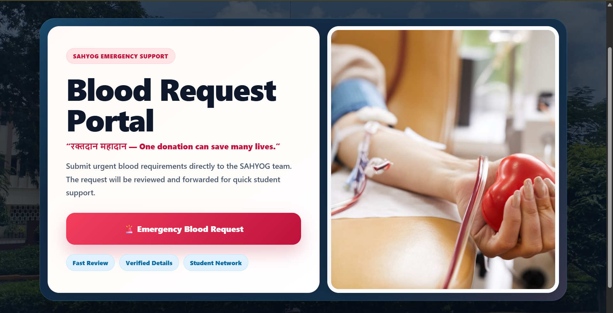
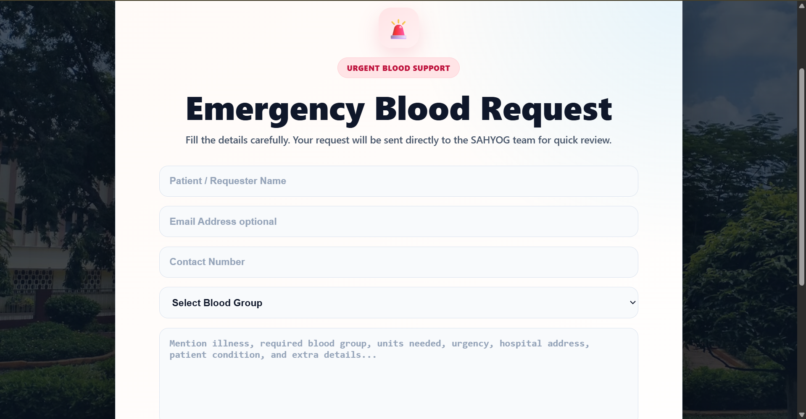

### Blood Request — Admin Response

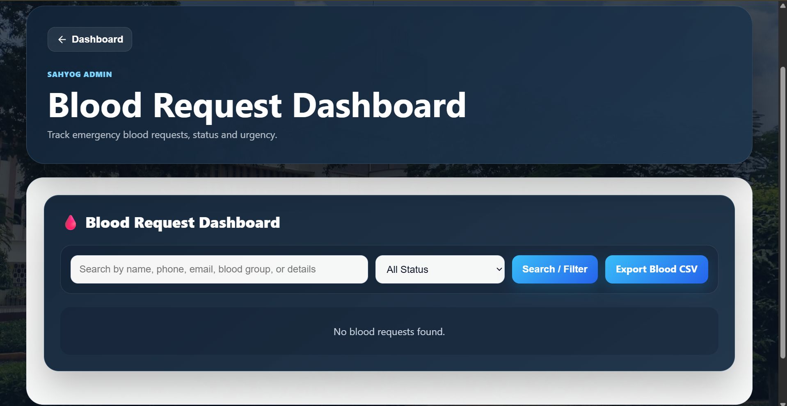

### Student Support Form

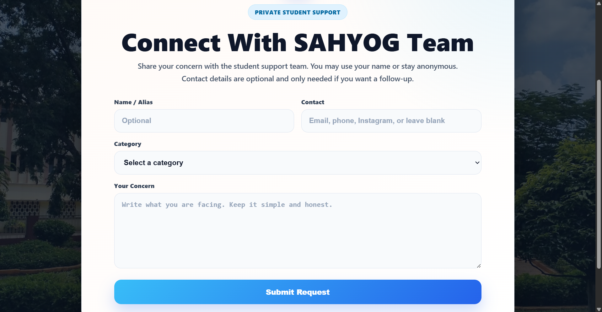

### Notification Center

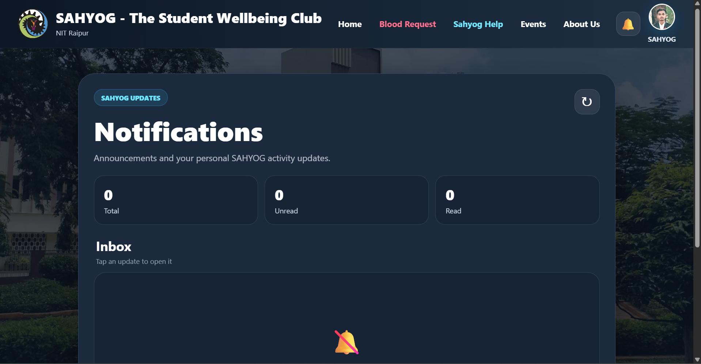

### Profile Dashboard

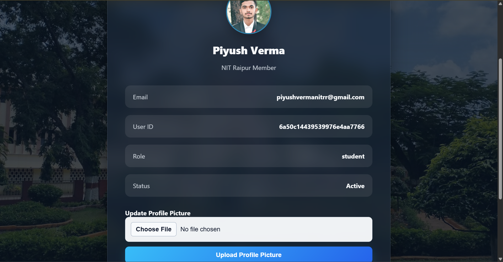

### Admin Dashboard

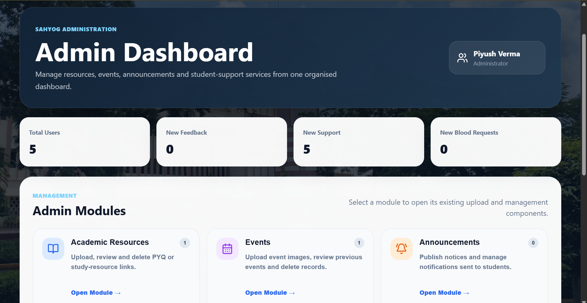
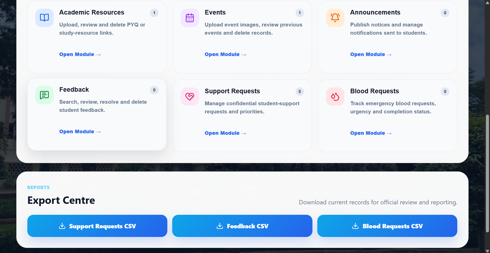

### Admin — Resource Upload

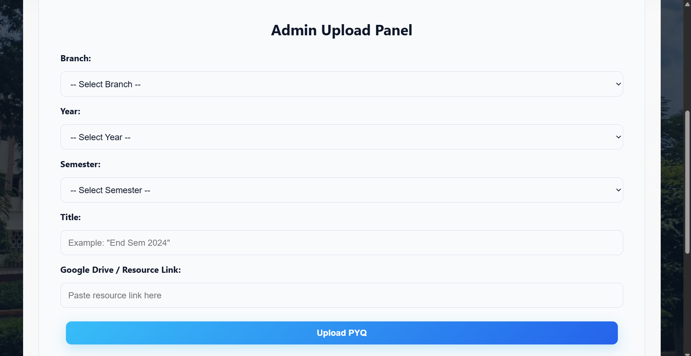

### Academic Resources (Links Section)

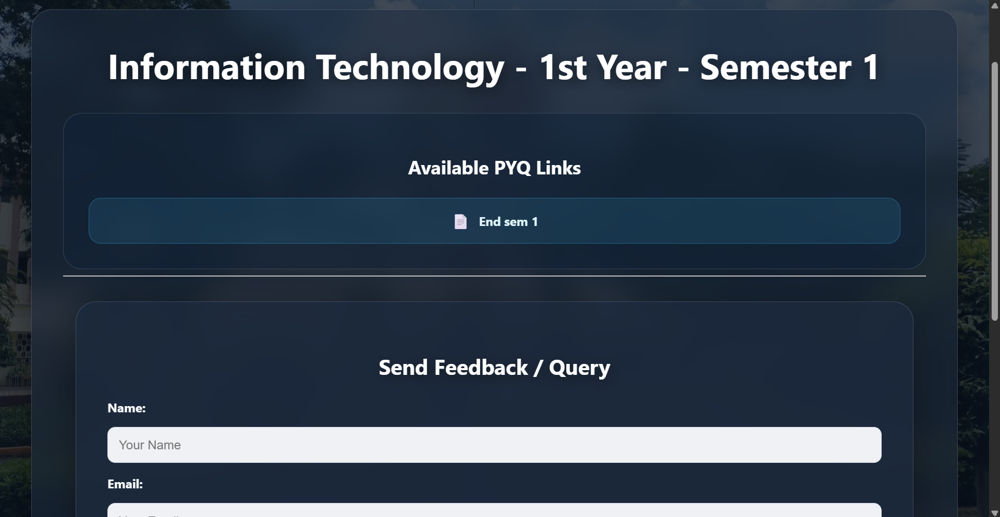

### Live Rooms (Voting/Elections)

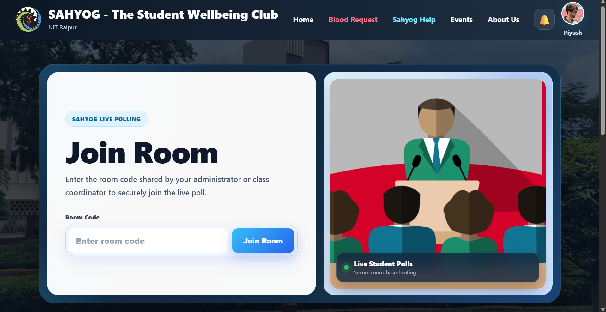

---

## Security

- JWT authentication with session restoration + Google OAuth (server-side token verification)
- Role-Based Access Control on all admin routes
- Passwords hashed with bcrypt
- Helmet + express-rate-limit against common attacks
- Request and file validation (type + size limits on uploads)
- Centralized error handling with an async error wrapper
- All secrets stored in environment variables — nothing committed to the repo

---

## Performance

- Redis caching on frequently-read data
- API pagination across resources, events, and notifications
- Cloudinary CDN for media delivery
- Modular API structure to avoid duplicate/overlapping requests
- Indexed MongoDB collections and optimized queries

---

## Deployment

The architecture was kept environment-agnostic by design — moving from local/staging to a production domain is a matter of environment configuration (API base URL, CORS origins, database URI, Redis URL), not application code changes. Designed with production deployment and institutional scalability in mind.

---

## Roadmap

**Completed**

- Modular frontend & backend architecture
- JWT + Google OAuth authentication with session restoration
- RBAC and protected admin routes
- Notification center + announcement system
- AI Buddy (Groq integration)
- Blood request & student support portals
- Event management with likes
- Live rooms (Socket.IO)
- Redis caching, Cloudinary media management
- Responsive, mobile-first UI

**Upcoming**

- Institutional domain deployment
- Push notifications
- Analytics dashboard for admin
- Multi-college support
- Faculty dashboard
- ERP integration
- Mobile app (React Native)

---

## Developer

**Piyush Kumar Verma**
Information Technology, National Institute of Technology Raipur

[LinkedIn](https://www.linkedin.com/in/piyush-verma-25550728a/)

Built with the goal of creating a centralized digital ecosystem for student life at NIT Raipur — and to practice full-stack engineering the way it's done in the industry.

---

## License

Copyright © 2026 Piyush Verma.
All Rights Reserved.

This repository is provided for portfolio and educational viewing only. No part of this project may be copied, redistributed, modified, or used in another project without explicit written permission from the author.

---

<div align="center">

**SAHYOG 2.0 — Learn Together • Support Together • Grow Together**

</div>
