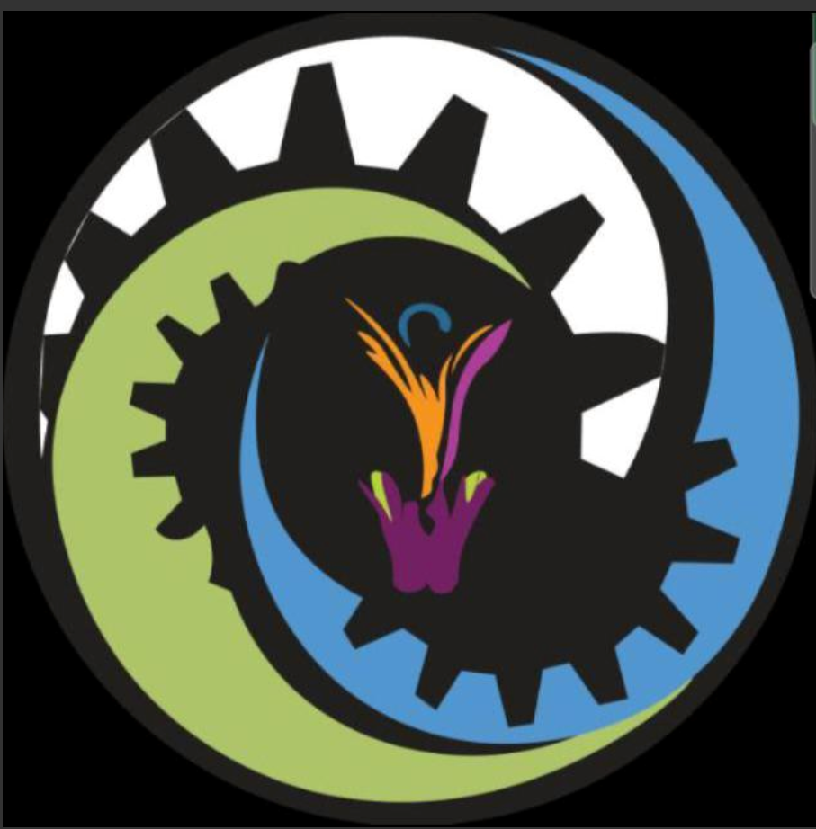

# SAHYOG - The WellBeing Club Portal (NIT Raipur)



A modern full-stack MERN web application developed for **SAHYOG - The WellBeing Club, NIT Raipur**.  
The platform serves as a centralized student support and academic resource portal designed to simplify access to study materials, emergency assistance, club activities, and future student welfare services.

The project focuses on building a scalable and student-friendly ecosystem combining academics, mentorship, wellbeing support, and emergency response systems into one unified portal.

---

# Live Deployment

### Frontend

https://sahyog-nitrr-portal.vercel.app/

### Backend

https://sahyog-backend-topb.onrender.com/

---

# Key Features

## Academic Resource Hub

- Access Previous Year Question Papers (PYQs)
- Browse resources branch-wise and semester-wise
- Structured academic navigation system
- Organized content viewer interface

---

## Emergency Blood Request System

- Publicly accessible blood request portal
- Emergency request submission form
- Gmail email automation using Nodemailer
- Multi-recipient email alerts
- Prescription / document upload support
- Emergency support workflow for urgent cases

---

## Authentication System

- Secure JWT Authentication
- Login & Registration functionality
- Protected and public routes
- Persistent authentication system
- User profile management

---

## Events & Club Activities

- Dynamic events section
- Club announcements and updates
- Event image uploads
- Interactive event interface

---

## Modern User Interface

- Fully responsive design
- Clean glassmorphism-inspired UI
- Mobile-friendly experience
- Animated navigation system
- Profile dropdown menu
- Modular feature architecture

---

## Future Expansion Modules

The portal architecture supports future integrations such as:

- CR Contact System
- Team Information Dashboard
- AI-based Student Assistance
- Volunteer Management
- Student Notifications
- Notes & Resources Expansion
- Admin Analytics Dashboard

---

# Screenshots

## Home Page


---

## Blood Request Portal


---

## Emergency Blood Request Form


---

## User Profile Dashboard


---

## About Us


---

# Tech Stack

## Frontend

- React.js
- Vite
- React Router DOM
- CSS3
- JavaScript (ES6+)

---

## Backend

- Node.js
- Express.js
- MongoDB Atlas
- Mongoose ODM
- JWT Authentication
- bcrypt.js
- Nodemailer
- Multer
- dotenv

---

## Deployment & Tools

- Vercel (Frontend Hosting)
- Render (Backend Hosting)
- MongoDB Atlas (Cloud Database)
- Git & GitHub

---

# Project Architecture

## Frontend Structure

```bash
frontend/
│
├── src/
│   ├── assets/
│   ├── components/
│   ├── context/
│   ├── pages/
│   ├── App.jsx
│   ├── main.jsx
│   └── styles.css
```

## Backend Structure

```bash
backend/
│
├── middleware/
├── models/
├── routes/
├── uploads/
├── server.js
└── .env
```

---

# Blood Request Email Workflow

```text
User submits blood request form
        ↓
Frontend sends data to backend API
        ↓
Backend validates request
        ↓
Prescription/document uploaded
        ↓
Nodemailer sends emergency email
        ↓
Multiple recipients receive alert instantly
```

---

# Security Features

- Password hashing using bcrypt.js
- JWT token authentication
- Environment variable protection
- Protected API routes
- File upload validation
- Secure backend configuration

---

# Future Enhancements

- AI-powered student assistant
- Real-time notifications
- Live donor availability system
- Admin analytics dashboard
- Student mentoring modules
- Resource recommendation engine
- Real-time chat support
- Volunteer coordination system

---

# Developed By

## Piyush Kumar Verma

Information Technology Department  
National Institute of Technology Raipur

Designed & Developed for  
**SAHYOG - The WellBeing Club**

---

# Faculty Guidance

Developed under the guidance and support of faculty coordinators and student members of SAHYOG Club, NIT Raipur.

---

# License

This project is developed for educational and institutional purposes under SAHYOG Club, NIT Raipur.
